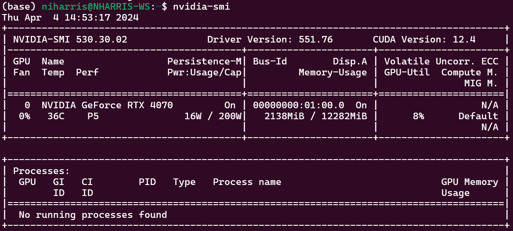

# Keras OCR Flask Service

This service, built with Python and Flask, utilizes Optical Character Recognition (OCR) technology to pinpoint words in images with remarkable precision. Simply submit an image along with a target word via a POST request, and the tool goes to work. If the word is located, it returns the exact coordinates of where it was found within the image. If the word remains elusive, the service will let you know it couldn't find it. 

Primary technologies used:

- [Flask](https://flask.palletsprojects.com/en/3.0.x/)
- [keras-ocr](https://github.com/faustomorales/keras-ocr)
- [TensorFlow](https://www.tensorflow.org/)

## Native Ubuntu Installation

To start we will install TensorFlow for Linux following the [official documentation](https://www.tensorflow.org/install/pip#linux). Our instructions assume you are using an Nvidia graphics card for CUDA acceleration.  

- We standardized on installing Keras OCR on Ubuntu Server 20.04 and these instructions are from a fresh install.
- This project is currently using TensorFlow 2.12.0

### 1 | Install Miniconda

Miniconda is the recommended approach for installing TensorFlow with GPU support, we follow this advice.

1. Execute `curl https://repo.anaconda.com/miniconda/Miniconda3-latest-Linux-x86_64.sh -o Miniconda3-latest-Linux-x86_64.sh`
2. Then execute `bash Miniconda3-latest-Linux-x86_64.sh`
    - You may need to restart your terminal or source ~/.bashrc to enable the conda command.
    - Use conda -V to test if it is installed successfully.


### 2 | Create a conda environment

We will create a conda environment in which to operate. In Labs we use the `/home/<user>` directory. We stick with the home directory because most of our deploys are to native machines with no other services; they are meant just for Keras.

Staring in the home directory of the user (`cd ~`):

1. Execute `conda create --name tf python=3.10`
2. Activate the environment with `conda activate tf` 


### 3 | Install GPU Driver, CUDA Toolkit, and cuDNN.

> You can skip this part if you just want to run Keras on the CPU, however many of the game tests that use Keras will fail as the CPU is not fast enough for some of the timings expected in the game tests.


Use [CUDA GPUs - Compute Capability](https://developer.nvidia.com/cuda-gpus) to find out which version of CUDA your GPU supports. In this case the 4090 supports 8.9.


[TensorFlow tested build configurations](https://www.tensorflow.org/install/source#gpu)

1. [Install the graphics card driver.](https://help.ubuntu.com/community/NvidiaDriversInstallation)
   - Execute `sudo ubuntu-drivers install` if you want automatic detection.
   - If you want to see the available drivers, run `sudo ubuntu-drivers list`
2. Use the following command to verify it is installed `nvidia-smi`.
3. Install Cuda Tool Kit with Conda
   - Execute `conda install -c conda-forge cudatoolkit=11.8.0`
4. Install cuDNN with pip.
   - Execute `pip install nvidia-cudnn-cu11==8.9.5` 
   - `8.6.0.163` for 30's series GPUs.
5. Configure the system paths. You can do it with the following command every time you start a new terminal after activating your conda environment.
    - `CUDNN_PATH=$(dirname $(python -c "import nvidia.cudnn;print(nvidia.cudnn.__file__)"))`
    - `export LD_LIBRARY_PATH=$CUDNN_PATH/lib:$CONDA_PREFIX/lib/:$LD_LIBRARY_PATH`
6. For your convenience it is recommended that you automate it with the following commands. The system paths will be automatically configured when you activate this conda environment.
    - `mkdir -p $CONDA_PREFIX/etc/conda/activate.d`
    - `echo 'CUDNN_PATH=$(dirname $(python -c "import nvidia.cudnn;print(nvidia.cudnn.__file__)"))' >> $CONDA_PREFIX/etc/conda/activate.d/env_vars.sh`
    - `echo 'export LD_LIBRARY_PATH=$CUDNN_PATH/lib:$CONDA_PREFIX/lib/:$LD_LIBRARY_PATH' >> $CONDA_PREFIX/etc/conda/activate.d/env_vars.sh`
7. Install TensorFlow
   1. `pip install --upgrade pip`
   2. `pip install tensorflow==2.12.0`

Test it works on CPU
```
python3 -c "import tensorflow as tf; print(tf.reduce_sum(tf.random.normal([1000, 1000])))"
```

Test it works on GPU
```
python3 -c "import tensorflow as tf; print(tf.config.list_physical_devices('GPU'))"
```

### Run Keras OCR API
Now we can install the rest of the dependencies and test if our API is working.

1. Install the rest of the dependencies.
    - Execute `pip install -r requirements.txt`
2. Test Keras and Tensorflow.
    - Execute `python3 test_cudapresence.py`
    - It should print out that GPU is available.
3. Execute `run-keras-service.sh`

## Docker Installation Ubuntu

This document does not provide detailed instructions on installing docker onto your system. 

The pre-requisites are that:
1. You have installed GPU driver and nvidia-smi returns expected output.
   - 
2. Install NVIDIA Container ToolKit
   - We used [1.8.1 version of NVIDIA Container ToolKit](https://docs.nvidia.com/datacenter/cloud-native/container-toolkit/1.8.1/install-guide.html)

## Running the service as a container
> :warning: The docker file in this repository has only been tested with our Ubuntu systems built purposefully for running this image. Your mileage may vary.

### 1 | Build the image
```bash
docker build -t <tag-name> -f Dockerfile . 
```

### 2 | Run the container
To run the container you just built run
```bash
docker run --shm-size=1g --ulimit memlock=-1 --name keras-ocr -p 5001:5001 --gpus all <tag-name>
```
This container has all the neccessary dependencies to run the service, including the model. You should be able to access the HTTP at port 5001 once launched.

## Devlopment docker container

You can run and build the container this way if you want to be able to make changes to the code and pick those changes up without having to rebuild the whole container.

### 1 | Build the image
```bash
docker build -t <tag-name> -f Dockerfile.dev . 
```

### 2 | Run the container
Ensure you run this command from the root of the respository so the correct directory is mounted to the container.

```bash
sudo docker run --shm-size=1g --ulimit memlock=-1 --name keras-ocr -it -v $(pwd):/repo --gpus all <tag-name>
```

### 3 | Install dependencies and run
Once you run the command from step 2 you should have been greeted to an SSH session into the running container.

```bash
# install general dependencies
pip install -r requirements_docker.txt

# install tensorflow
pip install tensorflow==2.12.0

# test if GPU is detected
python test_cudapresence.py

# run the service
python keras_server.py
```

# How to use via HTTP API
1. Send a post request to /process as form-data
2. Include the screenshot as "file" and the word you are searching for as "word"
3. Will return a json response

```
{
    "result": "found",
    "x": 3464,
    "y": 1872
}

or 

{
    "result": "not found"
}
```