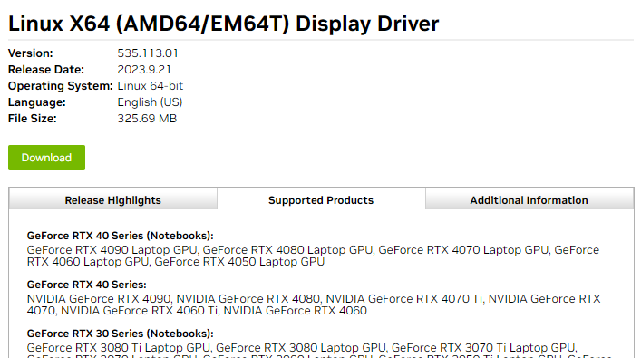
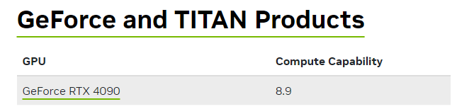

<!-- omit in toc -->
# keras-ocr Project

This is a project aiming to find the position (center coordinate) of a target word of a screenshot.

<!-- omit in toc -->
## Table of Contents
- [Installation](#installation)
- [Local Usage](#local-usage)
- [API Usage](#api-usage)

## Installation

To start we will install TensorFlow for Linux following the [official documentation](https://www.tensorflow.org/install/pip#linux). Our instructions assume you are using an Nvidia graphics card for CUDA acceleration.  

- We standardized on installing Keras OCR on Ubuntu Server 20.04 and these instructions are from a fresh install.
- This project is currently using TensorFlow 2.12.0

<!-- omit in toc -->
### 1 | Install Miniconda

Miniconda is the reccomended approach for installing TensorFlow with GPU support, we follow this advice.

1. Execute `curl https://repo.anaconda.com/miniconda/Miniconda3-latest-Linux-x86_64.sh -o Miniconda3-latest-Linux-x86_64.sh`
2. Then execute `bash Miniconda3-latest-Linux-x86_64.sh`
    - You may need to restart your terminal or source ~/.bashrc to enable the conda command.
    - Use conda -V to test if it is installed successfully.

<!-- omit in toc -->
### 2 | Create a conda environment

We will create a conda environment in which to operate. In Labs we use the `/home/<user>` directory. We stick with the home directory because most of our deploys are to native machines with no other services; they are meant just for Keras.

Staring in the home directory of the user (`cd ~`):

1. Execute `conda create --name tf python=3.10`
2. Activate the environment with `conda activate tf` 

<!-- omit in toc -->
### 3 | Install GPU Driver, CUDA Toolkit, and cuDNN.

> You can skip this part if you just want to run Keras on the CPU, however many of the game tests that use Keras will fail as the CPU is not fast enough for some of the timings expected in the game tests.

Using Nvidias [driver search tool](https://www.nvidia.com/download/index.aspx?lang=en-us) find the Linux driver for your specific card. In this case we found (at the time of writing) 535.113.01 for the RTX 4090.



Use [CUDA GPUs - Compute Capability](https://developer.nvidia.com/cuda-gpus) to find out which version of CUDA your GPU supports. In this case the 4090 supports 8.9.



[TensorFlow tested build configurations](https://www.tensorflow.org/install/source#gpu)

1. Install the graphics card driver, in this example 535.113.01.
2. Use the following command to verify it is installed `nvidia-smi`.
3. Install Cuda Tool Kit with Conda
   - Execute `conda install -c conda-forge cudatoolkit=11.8.0`
4. Install cuDNN with pip.
   - Execute `pip install nvidia-cudnn-cu11==8.9.5` 
   - `8.6.0.163` for 30's series GPUs.
5. Configure the system paths. You can do it with the following command every time you start a new terminal after activating your conda environment.
    - `CUDNN_PATH=$(dirname $(python -c "import nvidia.cudnn;print(nvidia.cudnn.__file__)"))`
    - `export LD_LIBRARY_PATH=$CUDNN_PATH/lib:$CONDA_PREFIX/lib/:$LD_LIBRARY_PATH`
6. For your convenience it is recommended that you automate it with the following commands. The system paths will be automatically configured when you activate this conda environment.
    - `mkdir -p $CONDA_PREFIX/etc/conda/activate.d`
    - `echo 'CUDNN_PATH=$(dirname $(python -c "import nvidia.cudnn;print(nvidia.cudnn.__file__)"))' >> $CONDA_PREFIX/etc/conda/activate.d/env_vars.sh`
    - `echo 'export LD_LIBRARY_PATH=$CUDNN_PATH/lib:$CONDA_PREFIX/lib/:$LD_LIBRARY_PATH' >> $CONDA_PREFIX/etc/conda/activate.d/env_vars.sh`
7. Install TensorFlow
   1. `pip install --upgrade pip`
   2. `pip install tensorflow==2.12.0`

Test it works on CPU
```
python3 -c "import tensorflow as tf; print(tf.reduce_sum(tf.random.normal([1000, 1000])))"
```

Test it works on GPU
```
python3 -c "import tensorflow as tf; print(tf.config.list_physical_devices('GPU'))"
```

<!-- omit in toc -->
### Run Keras OCR API
Now we can install the rest of the dependencies and test if our API is working.

1. Install the rest of the dependencies.
    - Execute `pip install -r requirements.txt`
2. Test Keras and Tensorflow.
    - Execute `python3 test_cudapresence.py`
    - It should print out that GPU is available.
3. Execute `run-keras-service.sh`

## Local Usage
Input images or screenshots will need to be stored in the folder 'images'. 

The default target word is 'options'.

The script will draw the bounding boxes of all the detected words in green. And the target word will be framed in a blue bounding box. Output images will be stored in the folder 'test_output_keras'.

## API Usage
1. Send a post request to /process as form-data
2. Include the screenshot as "file" and the word you are searching for as "word"
3. Will return a json response

```
{
    "result": "found",
    "x": 3464,
    "y": 1872
}

or 

{
    "result": "not found"
}
```